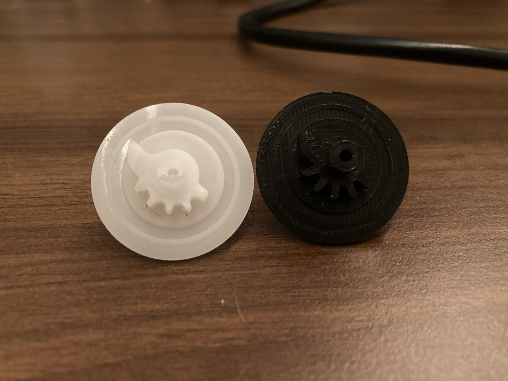

# Info

Remodelled the spare part 00177610 drive coupling part for my mothers food processor, after it broke of and no replacement was available online.

This part is meant to lock the knob and underlying potentiometer on the front of the device into its specific positions.

You can find info about replacement parts on the [Bosch website](https://www.bosch-home.com/de/supportdetail/product/MUM7300/04#/Tabs=section-spareparts/Togglebox=tb0036/).

# Download

You can download the latest [.stl](20231230-1909_Coupler.stl) from this repo which is ready to print. Fit perfectly in our machine.